# Project 01 – Advanced Task Management System

A professional command-line **Task Management System** developed in Python as **Project 01** for the **Decode Labs Python Programming Internship**.

The application provides an efficient solution for organizing daily tasks with advanced features such as task prioritization, due dates, searching, filtering, subtask management, statistics, persistent storage, and report exporting.

---

## Project Overview

The Advanced Task Management System is designed to help users efficiently manage personal and academic tasks through a clean command-line interface. The application supports complete task lifecycle management while demonstrating practical Python programming concepts and software development practices.

---

## Features

### Task Management
- Add new tasks
- View all tasks
- Update existing tasks
- Delete tasks
- Mark tasks as completed
- Mark completed tasks as pending
- View detailed task information

### Advanced Task Details
- Task title
- Description
- Priority levels
  - Low
  - Medium
  - High
  - Critical
- Due date management
- Tags
- Creation timestamp
- Update timestamp
- Completion timestamp

### Search & Filtering
- Search tasks by keyword
- Filter pending tasks
- Filter completed tasks
- View overdue tasks
- View upcoming tasks
- Filter high-priority tasks

### Sorting
- Newest first
- Oldest first
- Highest priority
- Due date

### Subtask Management
- Add subtasks
- Complete subtasks
- Delete subtasks

### Statistics Dashboard
- Total tasks
- Completed tasks
- Pending tasks
- Completion percentage
- Priority distribution
- Due soon tasks
- Overdue tasks
- Tag summary

### Data Persistence
- Automatic JSON data storage
- Automatic loading of previous tasks
- Separate task history file
- User-specific task database

### Export Functionality
- Export complete task list
- Export task statistics
- Generate formatted text reports

### Error Handling
- Input validation
- Invalid menu protection
- Date validation
- Exception handling
- Keyboard interrupt handling

---

## Technologies Used

- Python 3
- JSON
- Object-Oriented Programming (OOP)
- File Handling
- DateTime Module
- Type Hints

---

## Python Concepts Implemented

- Classes & Objects
- Functions
- Lists
- Dictionaries
- Loops
- Conditional Statements
- File Handling
- JSON Serialization
- Exception Handling
- Object-Oriented Programming
- Data Validation
- Modular Programming

---

## Application Workflow

1. Launch the application.
2. Enter your username.
3. Access the main menu.
4. Add and manage tasks.
5. Search or filter tasks.
6. Update or complete tasks.
7. Manage subtasks.
8. View task statistics.
9. Export task reports.
10. Save data and exit.

---

## Main Menu

```text
============================================================
MAIN MENU
============================================================

1. Add Task
2. View Tasks
3. Complete Task
4. Update Task
5. Delete Task
6. Search Tasks
7. Statistics
8. Manage Subtasks
9. Export Tasks
0. Save & Exit
```

---

## Screenshots

### APPLICATION LAUNCH & MAIN MENU

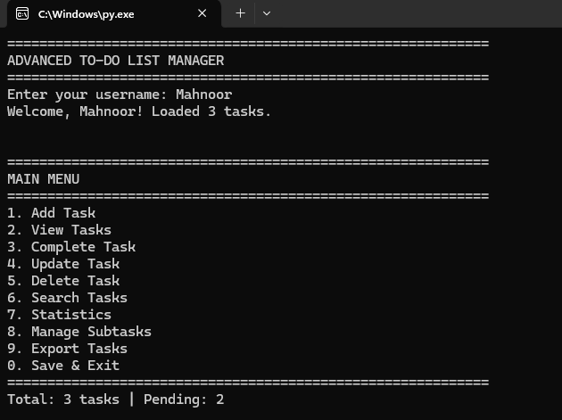

---

### ADDING A NEW TASK

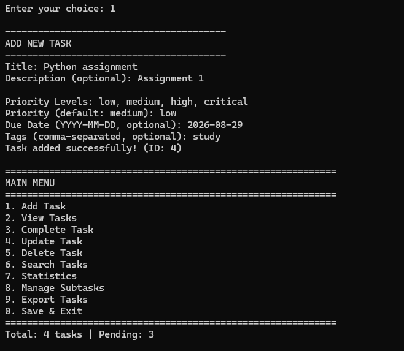

---

### VIEWING ALL TASKS

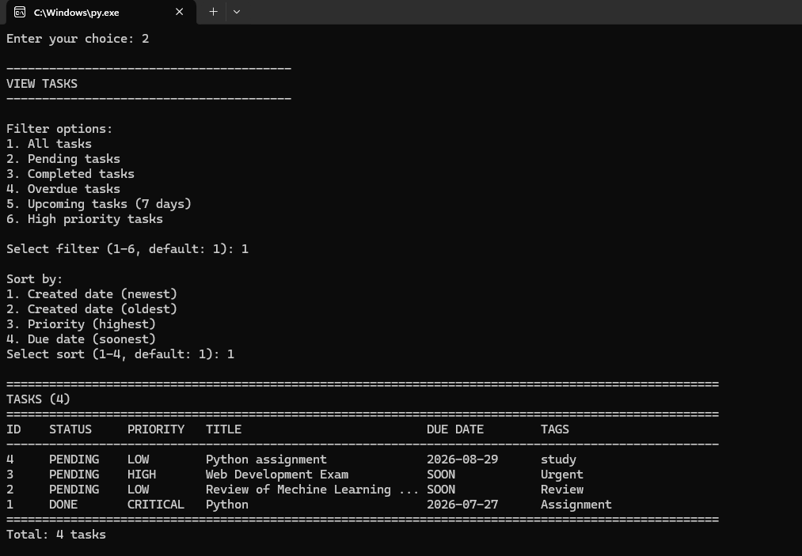

---

### TASK DETAILS VIEW

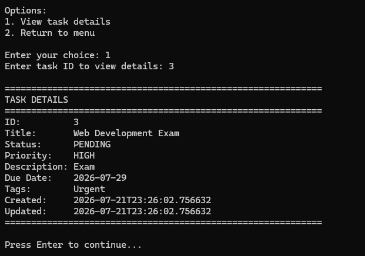

---

### ADDING A CRITICAL PRIORITY TASK

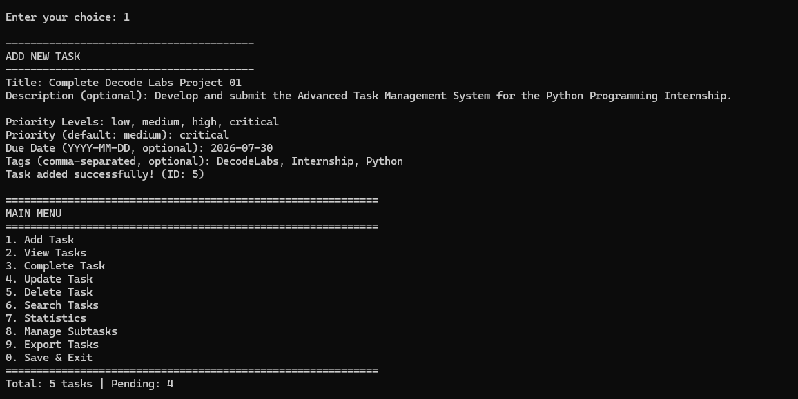

---

### TASK COMPLETION

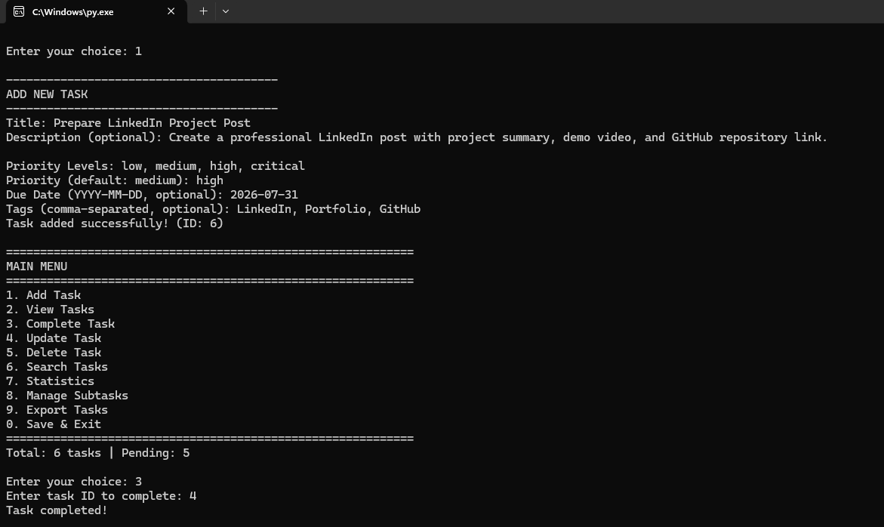

---

### UPDATING AN EXISTING TASK

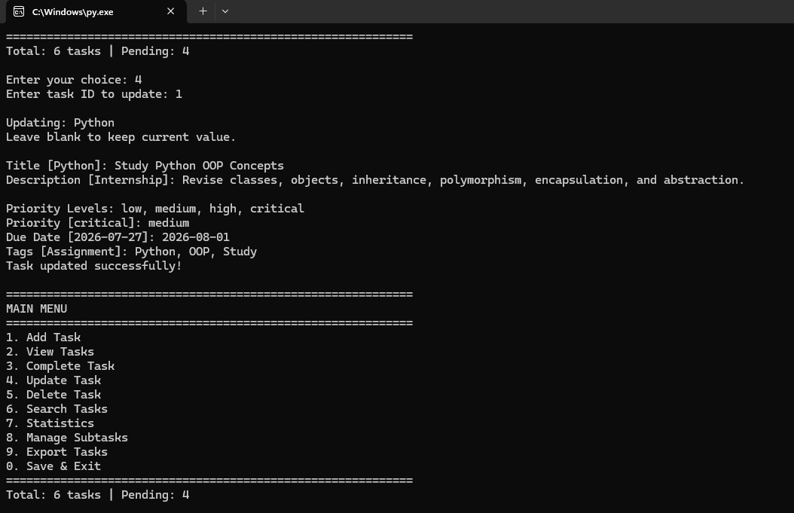

---

### DELETING AND SEARCHING TASKS

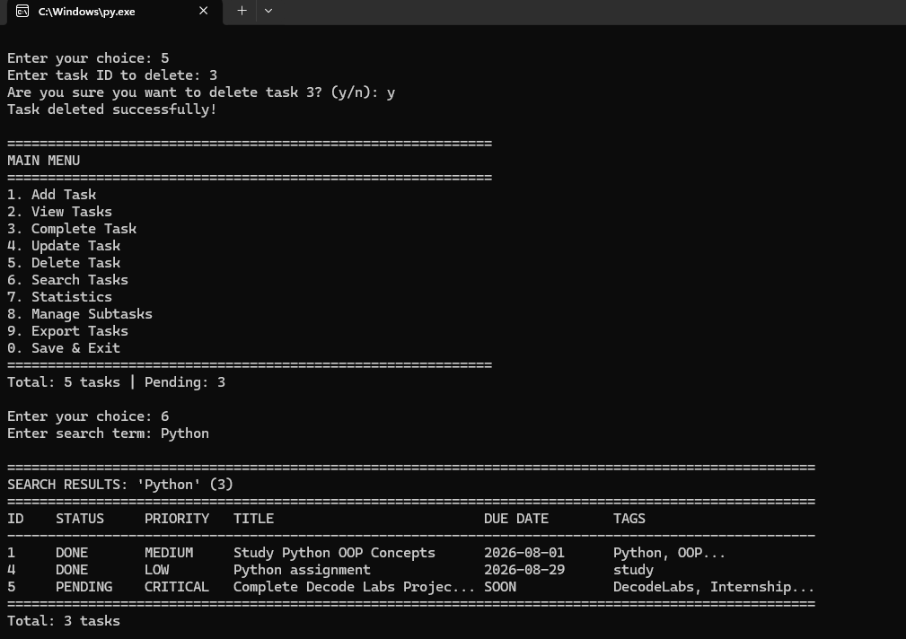

---

### COMPLETED TASK DETAILS

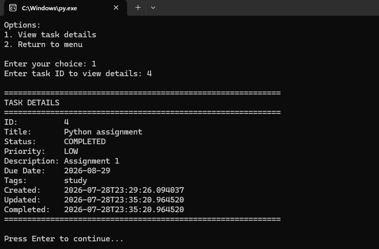

---

### TASK STATISTICS DASHBOARD

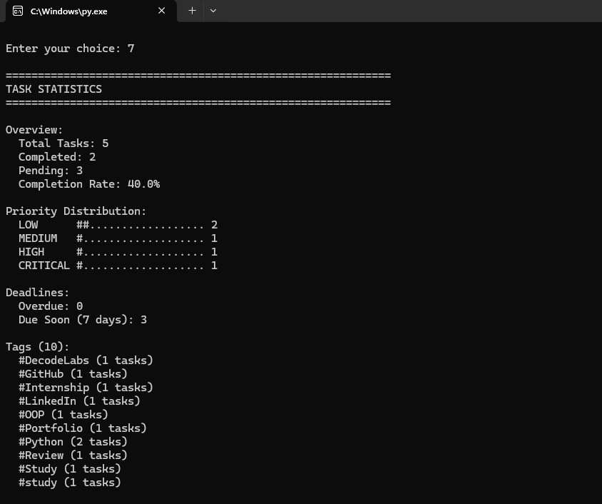

---

### SUBTASK MANAGEMENT

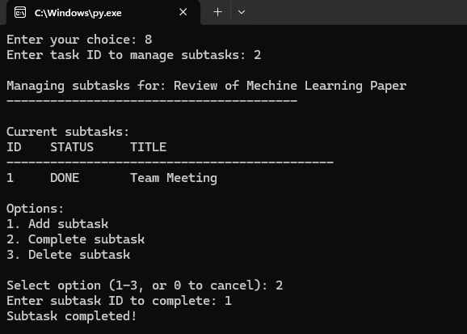

---

### EXPORTING TASKS

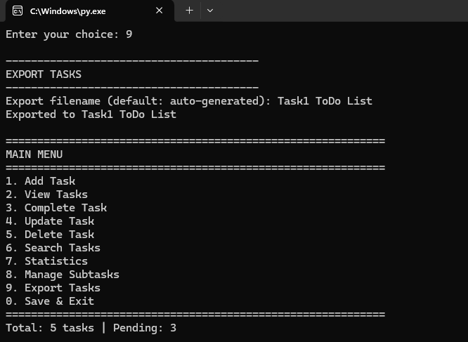

---

## Learning Outcomes

Through this project, I strengthened my understanding of:

- Python Programming
- Object-Oriented Programming
- JSON File Handling
- Data Persistence
- Modular Programming
- Exception Handling
- Data Structures
- Command-Line Application Development
- Clean Code Practices
- Problem Solving

---

## Author

**Mahnoor Yasir**

Python Programming Intern

Decode Labs

---

## License

This project was developed for educational purposes as part of the **Decode Labs Python Programming Internship**.
