# CyberVault Password Generator

A professional console-based password management application developed in Python using only the Python Standard Library. The application provides secure password generation, password strength analysis, password vault management, passphrase generation, API key generation, Wi-Fi password generation, data export/import, backup & restore, and multiple security utilities through an interactive menu-driven interface.

---

## Project Overview

CyberVault Password Generator is designed to help users create strong and secure passwords while providing additional password management and security analysis tools.

The application uses Python's `secrets` module for cryptographically secure random generation and follows modern password security recommendations to produce high-entropy passwords suitable for personal and professional use.

---

## Key Features

- Secure Password Generator
- Bulk Password Generator
- Password Strength Checker
- Password Vault Management
- Password History
- Security Analyzer
- Password Comparison
- Username Generator
- Passphrase Generator
- PIN Generator
- API Key Generator
- Wi-Fi Password Generator
- Export Data
- Import Data
- Backup & Restore
- Application Settings
- Help Center
- About Application

---

# Technologies Used

| Technology | Purpose |
|------------|----------|
| Python 3 | Core Programming Language |
| Python Standard Library | Built-in Modules |
| secrets | Cryptographically Secure Random Generation |
| string | Character Sets |
| math | Entropy Calculations |
| hashlib | Secure Hashing |
| uuid | UUID Generation |
| base64 | API Key Encoding |
| csv | CSV Export |
| json | Data Storage |
| datetime | Time & Date Handling |
| pathlib | File Management |
| os | File System Operations |

---

# Core Modules

### Password Generation

- Single Password Generation
- Bulk Password Generation
- Secure Random Passwords
- Easy-to-Pronounce Password Mode
- Custom Password Length
- Character Pool Configuration

---

### Password Analysis

- Password Strength Rating
- Entropy Calculation
- Character Diversity
- Estimated Crack Time
- Randomness Score
- Dictionary Check
- Sequential Character Detection
- Repeated Character Detection

---

### Password Vault

- Add New Password
- Save Website Credentials
- Store Email Accounts
- Store Usernames
- Search Vault
- Filter Records
- Sort Records
- Duplicate Password Detection
- Password Aging Report

---

### Password Utilities

- Username Generator
- Passphrase Generator
- PIN Generator
- API Key Generator
- Wi-Fi Password Generator
- Password Comparison

---

### Data Management

- Export Password Vault
- Import Password Vault
- Session History Export
- JSON Backup
- Restore Backup
- Reset Database

---

### Additional Features

- Interactive Console Dashboard
- Professional Menu System
- Session Statistics
- Password History
- Settings Management
- Help Center
- About Page
- Secure Random Generation
- Console-Based User Interface

---

# Project Structure

```text
Project 3 Random Password Generator
│
├── assets
│   └── images
│       ├── 01_Welcome_Screen.png
│       ├── 02_Main_Dashboard.png
│       ├── 03_Secure_Password_Generation.png
│       ├── 04_Bulk_Password_Generation.png
│       ├── 05_Password_Strength_Checker.png
│       ├── 06_Password_Vault_Management.png
│       ├── 07_Password_History.png
│       ├── 08_Security_Analyzer.png
│       ├── 09_Password_Comparison.png
│       ├── 10_Username_Generator.png
│       ├── 11_Passphrase_Generator.png
│       ├── 12_PIN_Generator.png
│       ├── 13_API_Key_Generator.png
│       ├── 14_WiFi_Password_Generator.png
│       ├── 15_Data_Export.png
│       ├── 16_Data_Import.png
│       ├── 17_Backup_and_Restore.png
│       ├── 18_Application_Settings.png
│       ├── 19_Help_Center.png
│       └── 20_About_Application.png
│
├── random password generator.py
├── README.md
└── .gitignore
```

---

# Installation

## Clone the Repository

```bash
git clone https://github.com/mahnoor-yasir/DecodeLabs-Internship.git
```

---

## Navigate to the Project

```bash
cd "Project 3 Random Password Generator"
```

---

## Run the Application

```bash
python "random password generator.py"
```

---

# Requirements

- Python 3.8 or above
- Windows, Linux, or macOS
- No third-party libraries required

---

# Application Menu

```
1. Generate Password
2. Bulk Password Generator
3. Password Strength Checker
4. Password Vault
5. Password History
6. Security Analyzer
7. Password Comparison
8. Username Generator
9. Passphrase Generator
10. PIN Generator
11. API Key Generator
12. Wi-Fi Password Generator
13. Export Data
14. Import Data
15. Backup & Restore
16. Settings
17. Help Center
18. About
19. Exit
```

---

# Application Screenshots

## 1. Welcome Screen

The application starts with a professional welcome screen that initializes the security engine and loads cryptographic modules before opening the main dashboard.

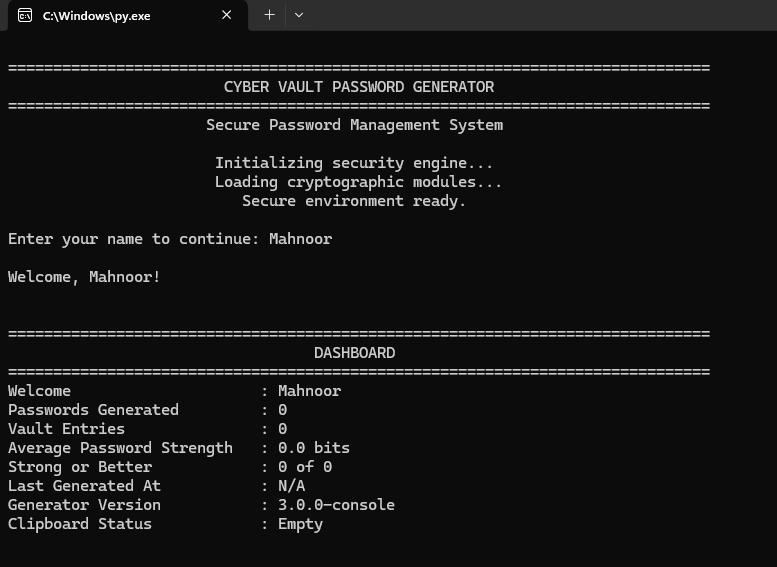

---

## 2. Main Dashboard

The dashboard provides an overview of the application, including password statistics, vault entries, password strength, generation history, and all available modules.

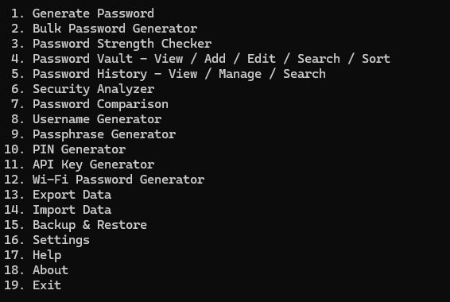

---

## 3. Secure Password Generation

Generate cryptographically secure passwords with configurable length, advanced generation options, entropy calculation, password strength analysis, and estimated crack time.

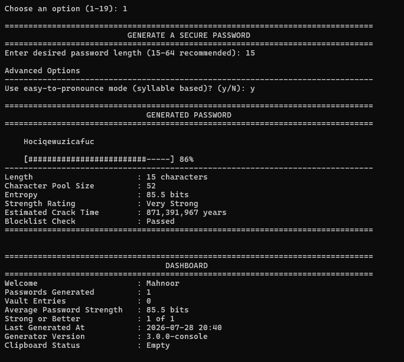

---

## 4. Bulk Password Generation

Generate multiple strong passwords simultaneously with customizable character sets and export-ready output.

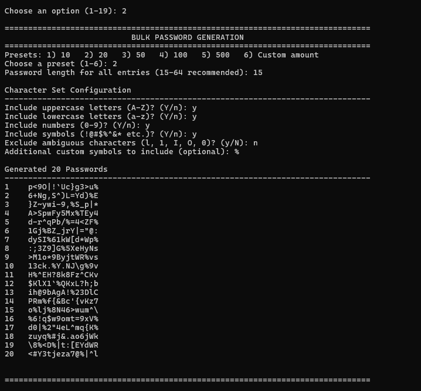

---

## 5. Password Strength Checker

Analyze any password using entropy calculations, randomness scoring, character diversity, crack-time estimation, and security recommendations.

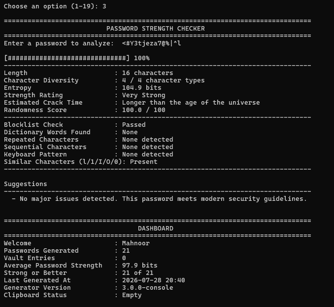

---

## 6. Password Vault Management

Securely manage website credentials by storing usernames, email addresses, passwords, notes, tags, and categories.

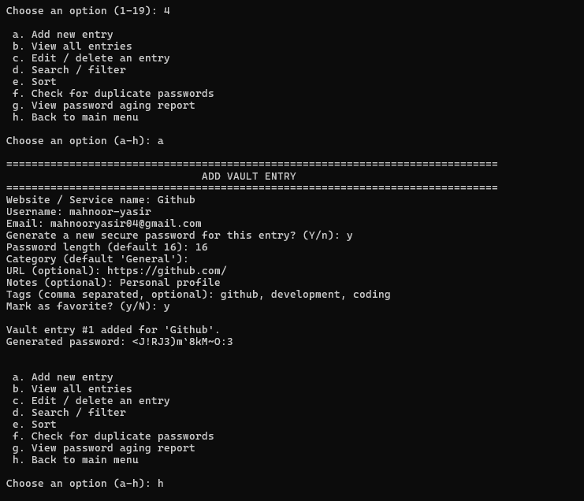

---

## 7. Password History

View all generated passwords along with password length, entropy, strength rating, and generation statistics.

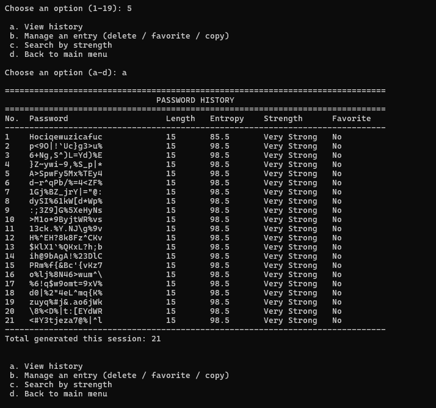

---

## 8. Security Analyzer

Perform an advanced security analysis of any password, including entropy, complexity score, randomness score, security rating, and NIST guideline checks.

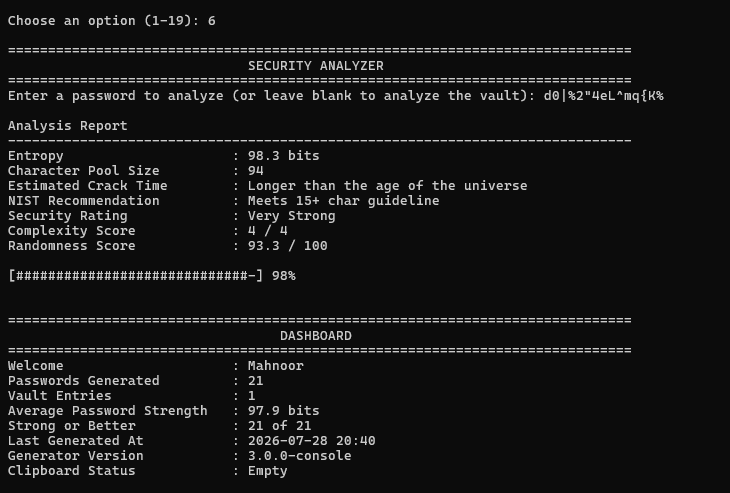

---

## 9. Password Comparison

Compare two passwords and evaluate their strength, entropy, crack time, diversity, and determine which password provides stronger security.

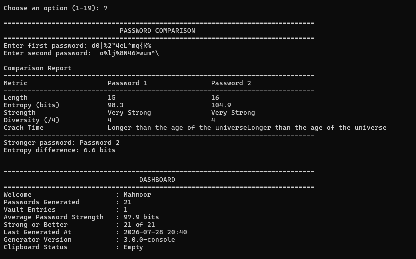

---

## 10. Username Generator

Generate professional username suggestions using first name, last name, nickname, and birth year combinations.

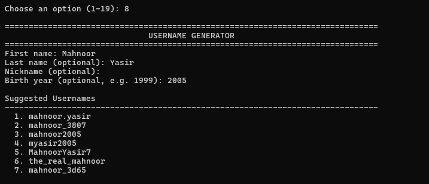

---

## 11. Passphrase Generator

Generate memorable passphrases with customizable word count, separators, capitalization, random numbers, and symbols.

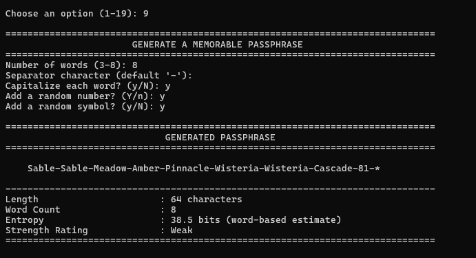

---

## 12. PIN Generator

Generate secure 4-digit, 6-digit, and 8-digit PINs with entropy calculation and randomness scoring.

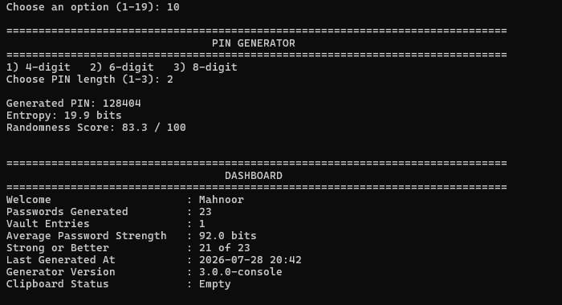

---

## 13. API Key Generator

Generate secure UUIDs, URL-safe tokens, hexadecimal keys, and Base64 encoded API keys for development purposes.

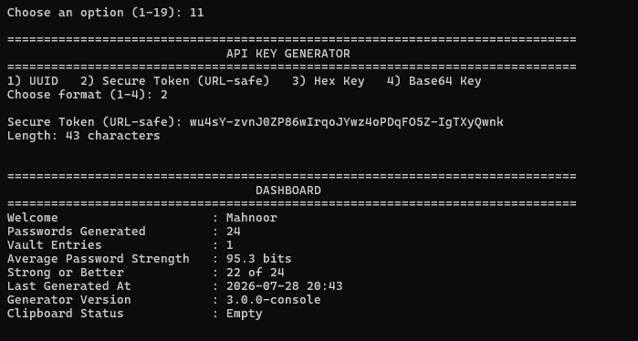

---

## 14. Wi-Fi Password Generator

Create highly secure Wi-Fi passwords for Home, Office, and Enterprise environments with maximum entropy.

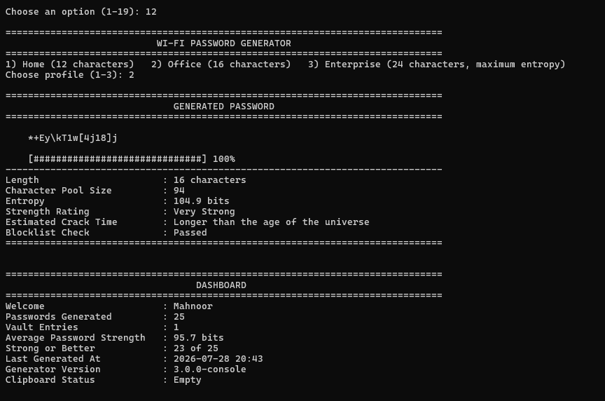

---

## 15. Export Data

Export password vault records and session history in multiple formats for backup and portability.

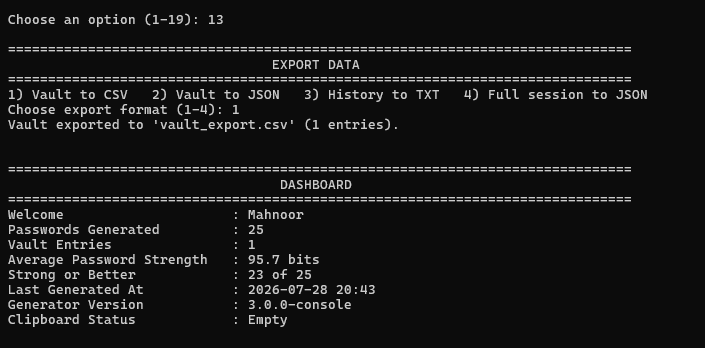

---

## 16. Import Data

Import previously saved password vault data to restore credentials and continue working with existing records.

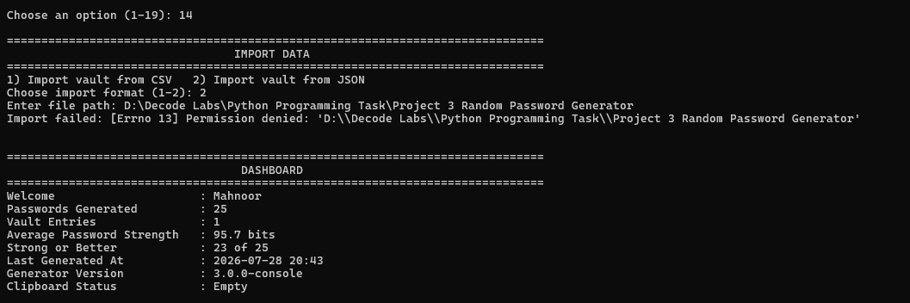

---

## 17. Backup and Restore

Create secure JSON backups, restore existing backups, and reset application data when required.

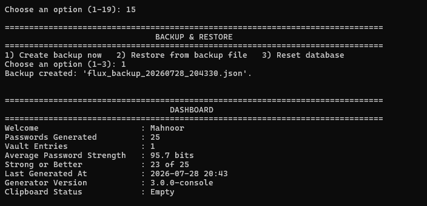

---

## 18. Application Settings

Customize application preferences, including default password length, character sets, clipboard timeout, auto-save, dark mode, and date formatting.

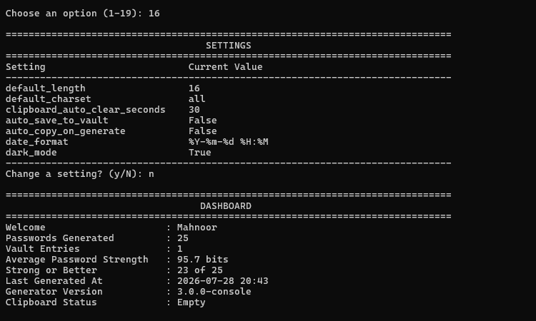

---

## 19. Help Center

Access the built-in documentation, frequently asked questions, password security recommendations, troubleshooting guidance, and NIST best practices.

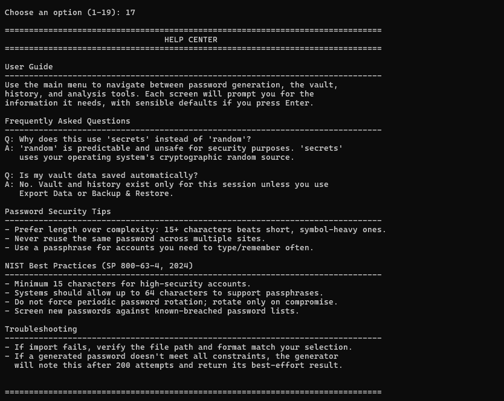

---

## 20. About Application

View application information including version, developer details, Python requirements, libraries used, and project description.

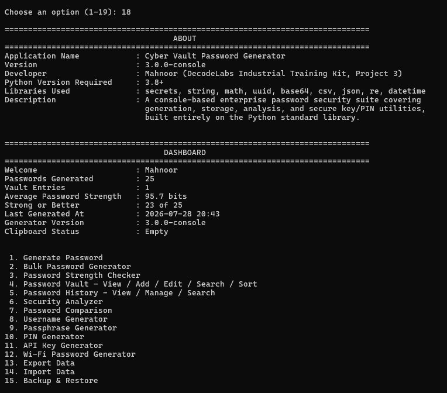

---

# Security Features

The application focuses on secure password management by implementing modern password generation techniques.

### Password Security

- Cryptographically Secure Password Generation
- High Entropy Passwords
- Password Strength Analysis
- Password Complexity Evaluation
- Password Randomness Scoring
- Password Comparison
- Password History
- Duplicate Password Detection

### Vault Security

- Password Vault Management
- Password Categorization
- Password Tags
- Password Favorites
- Password Aging Report

### Data Management

- JSON Backup
- JSON Restore
- CSV Export
- JSON Export
- TXT Export
- CSV Import
- JSON Import

---

# Why Use CyberVault Password Generator?

- Easy to Use
- Secure Password Generation
- Modern Password Analysis
- Organized Password Vault
- Built with Python
- No Third-Party Libraries Required
- Beginner Friendly
- Professional Console Interface
- Lightweight
- Cross Platform

---

# Learning Outcomes

This project demonstrates practical implementation of:

- Object-Oriented Programming Concepts
- Python Standard Library
- Secure Random Number Generation
- File Handling
- JSON Processing
- CSV Processing
- Data Management
- Password Security Principles
- Entropy Calculation
- String Manipulation
- Regular Expressions
- Console-Based Application Development

---

# Author

**Mahnoor Yasir**

Computer Science Student

University of Management and Technology (UMT)

Lahore, Pakistan

GitHub

https://github.com/mahnoor-yasir

LinkedIn

https://linkedin.com/in/mahnoor-yasir

Email

mahnooryasir04@gmail.com

---

# License

This project was developed for educational purposes as part of the **Decode Labs Python Programming Internship**.

The source code may be used for learning, academic projects, and personal practice.

---

# Acknowledgements

This project was completed as **Project 03** during the Decode Labs Python Programming Internship.

Special thanks to Decode Labs for providing the opportunity to strengthen Python programming skills through practical software development projects.

---


## Thank You

Thank you for visiting this repository.

If you found this project useful, consider giving it a star and exploring the other projects available on my GitHub profile.
